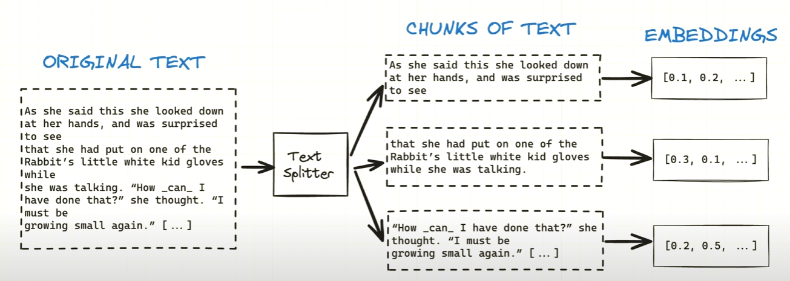

# naive-rag
Simple RAG based app



# Setup

### Dependencies
```bash
  pip install -r requirements.txt
```

### Data ingestion
```bash
  python populate_database.py
```

### Query data
```bash
  python query_data.py "beside the bank's money, the bank holds what?"
```

### Env
```dotenv
OPENAI_API_KEY=<your-api-key>
```

# References
 - [PyPDFDirectoryLoader](https://python.langchain.com/api_reference/community/document_loaders/langchain_community.document_loaders.pdf.PyPDFDirectoryLoader.html#langchain_community.document_loaders.pdf.PyPDFDirectoryLoader)
 - [Text splitters](https://python.langchain.com/api_reference/text_splitters/index.html)
 - [Chromadb](https://python.langchain.com/api_reference/community/vectorstores/langchain_community.vectorstores.chroma.Chroma.html)
 - [ChatOpenAI](https://python.langchain.com/api_reference/openai/chat_models/langchain_openai.chat_models.base.ChatOpenAI.html)